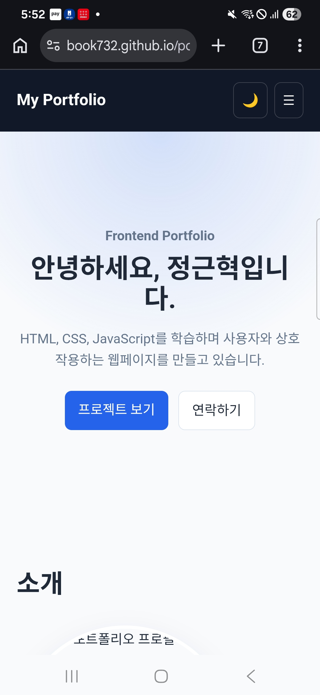
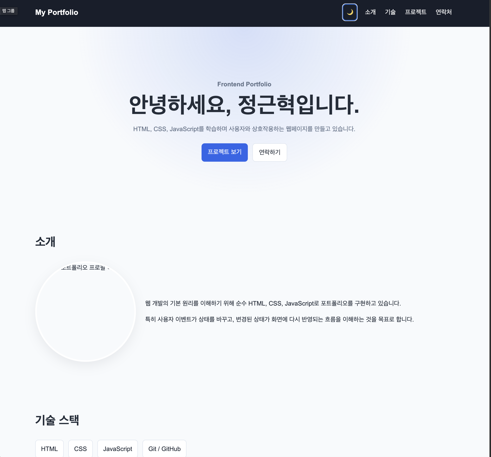
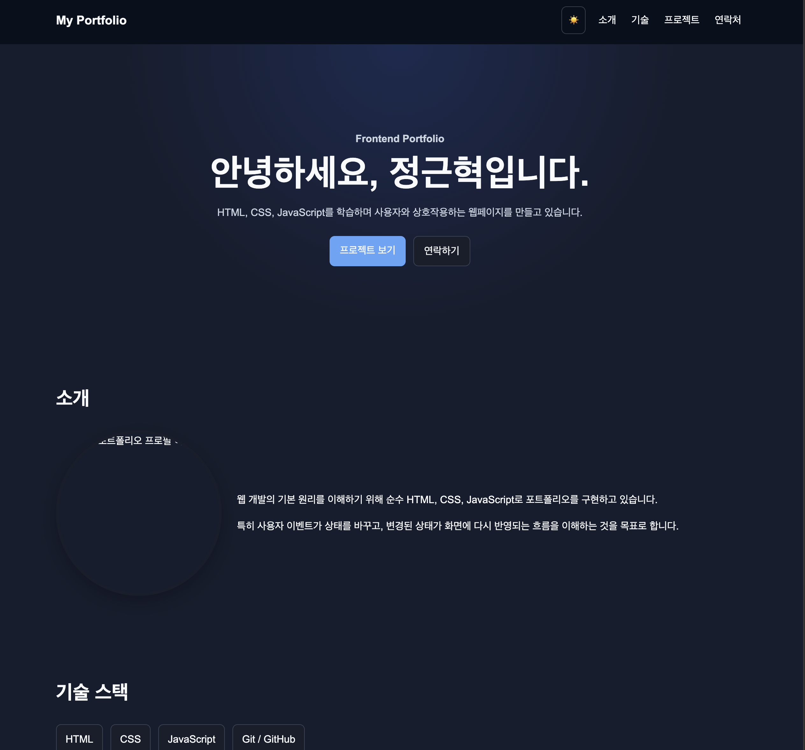

# Portfolio Website

순수 HTML, CSS, JavaScript로 제작한 개인 포트폴리오 웹사이트입니다.

이 프로젝트는 React 학습 전에 웹의 기본 동작인

사용자 이벤트 → 상태 변경 → 화면 업데이트

흐름을 직접 구현하고 이해하는 것을 목표로 합니다.

## 배포 주소

https://book732.github.io/portfolio_1/

## 주요 기능

- 반응형 웹 디자인
- 모바일 햄버거 메뉴
- 부드러운 스크롤
- 스크롤 60px 이상에서 네비게이션 스타일 변경
- 스크롤 300px 이상에서 맨 위로 가기 버튼 표시
- 다크 / 라이트 모드
- localStorage를 이용한 테마 저장
- IntersectionObserver 스크롤 애니메이션
- GitHub API 저장소 표시
- 로딩 / 성공 / 에러 / 빈 상태 처리
- GitHub API 재시도 버튼
- GitHub API 403 Rate Limit 처리
- 프로젝트 언어 필터
- 연락처 폼 유효성 검사

## 사용 기술

- HTML
- CSS
- JavaScript
- GitHub API
- GitHub Pages


## 실행 화면

### 데스크톱



### 모바일



### 다크 모드



## 프로젝트 구조s

```txts
portfolio_1/
├── index.html
├── css/
│   └── style.css
├── js/
│   └── script.js
├── images/
│   └── profile.svg
└── README.md


